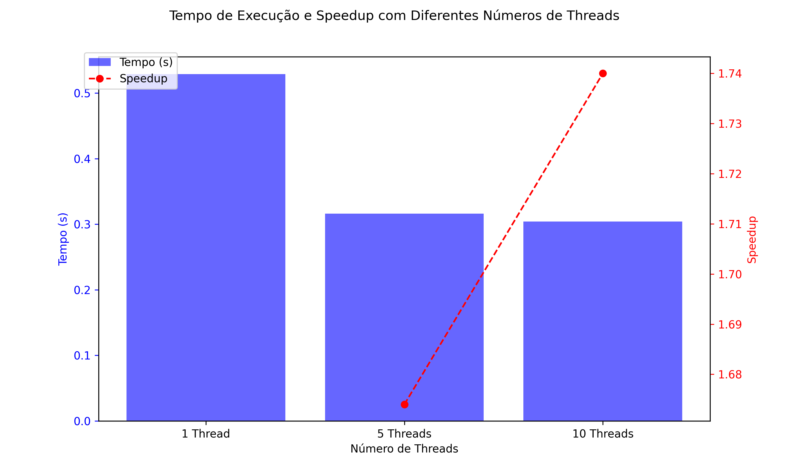

### Análise de tempo de execução e speedup

##### Tabela do tempo de execução

| Num Threads | Tempo (s) |
| ----------- | --------- |
| 1           | 0,529     |
| 5           | 0,316     |
| 10          | 0,304     |
##### Tabela do speedup

| Num Threads | Speedup |
| ----------- | ------- |
| 5           | 1,674   |
| 10          | 1,740   |
##### Gráfico do tempo de execução e do speedup para os testes realizados

